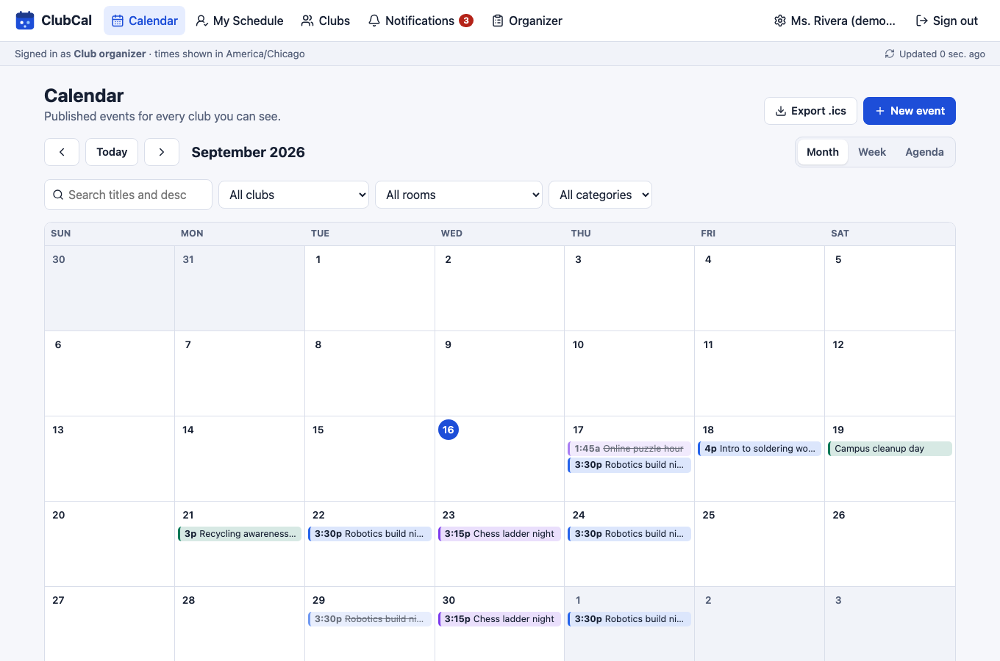
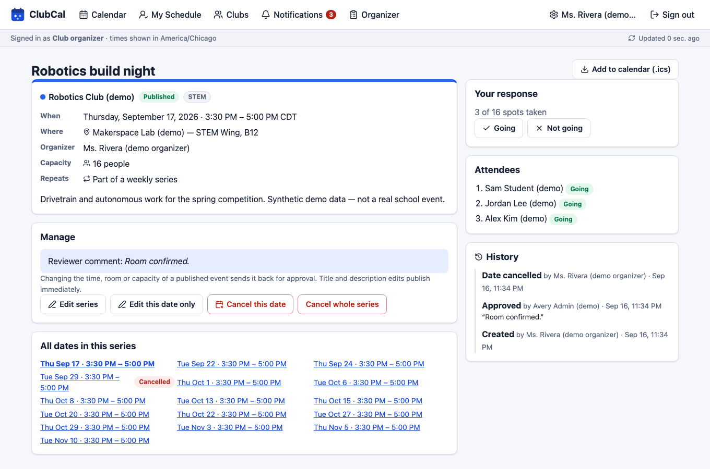
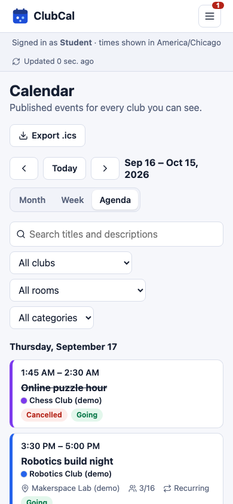

# ClubCal — shared calendar & scheduling for school clubs

ClubCal is a self-hosted calendar for school clubs:

- **Administrators** manage clubs, rooms and users, and approve events.
- **Club organizers** schedule meetings (including weekly series), reserve rooms, and find free times.
- **Students** browse events, join clubs, RSVP (with waitlists), and receive reminders.

All data lives in PostgreSQL and every feature in the UI is backed by the API. Nothing needs an external account, paid service or API key.

> This repository started as a browser-only calendar (kept in [`legacy/`](legacy/)). That version stored events in each browser's `localStorage` and checked a hard-coded admin password in JavaScript. See [legacy/README.md](legacy/README.md) for what was found and how the old data can be imported.

| | |
|---|---|
| Frontend | React 19 + TypeScript + Vite, TanStack Query |
| Backend | Node.js 22 + TypeScript + Express 5 (modular monolith), Zod validation |
| Database | PostgreSQL 16, SQL migrations, Kysely typed queries, `btree_gist` exclusion constraints |
| Jobs | Separate worker process, [pg-boss](https://github.com/timgit/pg-boss) queue in PostgreSQL |
| Email | Optional SMTP; [Mailpit](https://mailpit.axllent.org/) captures mail locally |
| Tests | Vitest (real PostgreSQL), Testing Library, Playwright |

Documentation: [Architecture](docs/ARCHITECTURE.md) · [API](docs/API.md) · [Interview guide](docs/INTERVIEW_GUIDE.md)

## Screenshots



| Event details with RSVP, attendees and history | Mobile agenda |
|---|---|
|  |  |

## Features

- **Shared calendar:** month, week and agenda views; search; filters by club, room and category; clear status labels; club colours.
- **Accounts and roles:** administrators, club organizers and students, with server-side sessions and permissions scoped to each club.
- **Approval workflow:** draft → pending → approved/rejected, plus cancellation, with a full audit trail.
- **Room booking:** opening hours are enforced and double-booking is prevented by the database.
- **Find available times:** suggests slots from room availability and people's declared availability, and explains every suggestion.
- **Weekly recurring meetings:** keep their local time across daylight-saving changes; one date or the whole series can be edited or cancelled.
- **RSVPs:** capacity limits and a first-come-first-served waitlist with automatic promotion.
- **Reminders:** 24 hours and 1 hour before events, as in-app notifications and optional email (captured locally by Mailpit).
- **Calendar export:** `.ics` download for Google Calendar, Outlook or Apple Calendar.
- **Old data:** an admin import for events saved by the original browser-only version.

---

## Quick start (Docker, recommended)

Requirements: Docker with Compose v2 (Docker Desktop, Colima, or Docker Engine), plus git.

```bash
git clone https://github.com/AgiKukudala/WWT_Project.git
cd WWT_Project
docker compose up -d --build                     # db, migrations, app, worker, mailpit
docker compose run --rm migrate node dist/seed.js   # OPTIONAL: synthetic demo data
```

| What | URL |
|---|---|
| ClubCal (web + API, same origin) | http://localhost:3000 |
| Health check | http://localhost:3000/api/health |
| Mailpit (captured email) | http://localhost:8025 |

**Development-only demo logins** (created only by the explicit seed command above; the password is the same for all):
`clubcal-demo-password`

| Role | Email |
|---|---|
| Administrator | `admin@demo.clubcal.test` |
| Organizer (Robotics, Chess) | `rivera@demo.clubcal.test` |
| Organizer (Drama, Green Team, Debate) | `patel@demo.clubcal.test` |
| Students | `sam@…`, `jordan@…`, `alex@…`, `priya@demo.clubcal.test` |

Everything the seed creates is labelled "(demo)" / "Synthetic demo data" and flagged `is_demo` in the database. Event dates are relative to the day you seed. Re-seed with `docker compose run --rm migrate node dist/seed.js --reset`. The seed refuses to run when `NODE_ENV=production`.

Useful commands:

```bash
docker compose ps                  # all services should be "healthy" (migrate exits 0)
docker compose logs -f app worker  # follow logs
docker compose down                # stop (data is kept in the pgdata volume)
docker compose down -v             # stop AND delete all data
```

### Your first real administrator (no demo data)

```bash
docker compose run --rm -it migrate node dist/create-user.js --email you@school.edu --name "Your Name" --role admin
```

The command prompts for a password (min. 10 characters). Anyone else can self-register at `/register`. Self-registration always creates a **student**. Administrators promote people by assigning them as organizers of a club (Admin → Clubs → Assign organizer) or on Admin → Users.

### Password reset (no email provider needed)

```bash
docker compose run --rm -it migrate node dist/reset-password.js --email person@school.edu
# local dev:  npm run admin:reset-password -- --email person@school.edu
```

This sets a new password, signs the user out everywhere, clears login throttling, and writes an audit record.

---

## Local development (without Docker)

Requirements: Node.js ≥ 22.12 and PostgreSQL 16 with the `btree_gist` and `citext` contrib extensions (included in standard packages). For email testing, also run Mailpit (`brew install mailpit && mailpit`).

```bash
npm ci
cp .env.example .env               # then set DATABASE_URL to your local database
createdb clubcal
npm run migrate                    # repeatable; applies only new migrations
npm run seed                       # optional synthetic demo data
npm run dev                        # API :3000, worker, and Vite :5173 (proxies /api)
```

Open http://localhost:5173 (hot reload), or build and serve everything from the API with `npm run build`, then set `STATIC_DIR=../web/dist` and run `npm start -w server` + `npm run start:worker -w server`.

### Configuration

All settings are environment variables; see [`.env.example`](.env.example). Key ones:

| Variable | Purpose |
|---|---|
| `DATABASE_URL` | PostgreSQL connection string |
| `SESSION_SECRET` | Required in production (the app refuses to start with the default) |
| `COOKIE_SECURE` | `auto` = Secure cookies when `NODE_ENV=production`. Needs HTTPS. |
| `APP_ORIGIN` | Origins allowed to send state-changing requests |
| `SMTP_HOST` … `MAIL_FROM` | Outgoing email. Empty `SMTP_HOST` disables email. |
| `REMINDER_POLL_SECONDS` | How often the worker looks for due reminders |

Docker Compose deliberately reads **`COMPOSE_`-prefixed** overrides (`COMPOSE_SMTP_HOST`, `COMPOSE_PUBLIC_URL`, …). That way a local-development `.env` (for example `SMTP_HOST=localhost`) cannot leak into the containers. It also reads `POSTGRES_PASSWORD`, `SESSION_SECRET`, `APP_PORT` and `MAILPIT_PORT`.

### About email and reminders — please read

- **Mailpit is not email delivery.** In the default setup every message is *captured* by Mailpit and shown at http://localhost:8025. Nothing reaches real inboxes. To deliver real mail, point `COMPOSE_SMTP_HOST`/`SMTP_HOST` (plus port, user, password, `SMTP_SECURE`) at your school's SMTP relay or another SMTP provider. That requires credentials from that provider.
- **Email is at-least-once.** A crash between the SMTP server accepting a message and ClubCal recording it can cause a duplicate email. In-app notifications are de-duplicated and are never duplicated.
- **Reminders need a running server.** 24-hour and 1-hour reminders are sent by the `worker` process, not by the browser, so users don't need ClubCal open. But the worker has to be running: a laptop that is asleep or shut down sends nothing. Missed reminders are delivered when the worker comes back, unless the event has already started (those are marked *skipped*). For real use, run the stack on an always-on server.
- **Calendar export is a file, not sync.** "Add to calendar (.ics)" and "Export .ics" download a snapshot you can import into Google Calendar, Outlook or Apple Calendar. It does not update when events change. Two-way Google/Microsoft sync is intentionally not included; it would require OAuth credentials from those providers.

---

## Testing

```bash
createdb clubcal_test clubcal_e2e      # once; or set TEST_DATABASE_URL / E2E_DATABASE_URL
npm run typecheck                      # shared, server, web, e2e
npm test                               # Vitest: shared + server (real PostgreSQL) + web
npm run build                          # production build (required before e2e)
npx playwright install chromium        # once
npm run test:e2e                       # Playwright; starts its own isolated stack on :3100
```

Defaults assume PostgreSQL at `postgres://postgres@localhost:54329/…`. Override with `TEST_DATABASE_URL` and `E2E_DATABASE_URL`. The server test suite drops and re-creates the schema of the test database on each run.

What the tests prove (highlights):

- Authentication: argon2id hashing, HttpOnly/SameSite cookies, logout invalidation, expiry, CSRF and origin checks, login rate limiting, and that registration can't choose a role.
- Permissions: organizers can't touch another club's events, even by ID; club-only events, drafts and pending events are invisible (404) to unauthorized users, including in `.ics` export.
- Concurrency: 2 and 8 simultaneous overlapping bookings give exactly one success; adjacent bookings both succeed; the database exclusion constraint rejects overlaps directly. 25 simultaneous RSVPs never exceed capacity, and waitlist promotion is FIFO and atomic.
- Stale edits of a series or of a single occurrence return `409 version_conflict`.
- Recurrence across US DST changes, nonexistent/ambiguous local times, one-year bounds, and per-occurrence edits and cancellations.
- Reminders survive a worker restart, never duplicate in-app notifications, and never fire for edited, cancelled or un-RSVP'd events.
- `.ics` output parses with `ical.js`, with correct escaping, folding, UTC times, all-day dates, stable UIDs and CANCELLED status.
- Untrusted HTML in titles renders as text (component tests and e2e).
- End to end: organizer submits → admin approves → student sees it and RSVPs → the worker delivers a real 1-hour reminder → organizer cancels → the student sees the cancellation.

CI (`.github/workflows/ci.yml`) runs type checks, all tests against PostgreSQL, the production build, Playwright, and a Docker Compose smoke test.

### Benchmark (optional)

```bash
npm run bench -- --users 200 --capacity 50 --bookers 40 --events 300
```

The benchmark creates throwaway data, measures concurrent RSVPs, conflicting bookings and a month query, prints the results, and cleans up. One local run (Apple Silicon laptop, Node 24, PostgreSQL 16, same machine) printed: 200 concurrent RSVPs in 336 ms (50 going / 150 waitlisted, correct); 40 conflicting bookings → exactly 1 success; month query over 302 events p50 2.1 ms / p95 3.4 ms. Your numbers will differ; these are not published performance claims.

---

## Backup and restore

```bash
# Backup (custom format, compressed)
mkdir -p backups
docker compose exec -T db pg_dump -U clubcal -d clubcal --format=custom > backups/clubcal-$(date +%F).dump

# Restore into a fresh database
docker compose stop app worker
docker compose exec -T db psql -U clubcal -d postgres -c "DROP DATABASE clubcal WITH (FORCE)" -c "CREATE DATABASE clubcal"
docker compose exec -T db pg_restore -U clubcal -d clubcal --no-owner < backups/clubcal-YYYY-MM-DD.dump
docker compose start app worker
```

The backup includes the job queue (`pgboss` schema), so scheduled reminders are restored too. Data persists in the `pgdata` Docker volume across `docker compose down` / `up`. Only `down -v` deletes it. The restore procedure above was exercised against the Compose stack during development.

## Project layout

```
shared/   Zod schemas, DTO types, legacy JSON parser (used by server and web)
server/   Express API, domain modules, worker, SQL migrations, CLI tools, tests
web/      React SPA
e2e/      Playwright tests and the isolated stack launcher
legacy/   The original static calendar (kept for reference and attribution)
docs/     Architecture, API, interview guide
```

## License and attribution

The original calendar UI in `legacy/` credits "A Project By Open Source Coding" (https://www.youtube.com/channel/UCiUtBDVaSmMGKxg1HYeK-BQ). That credit is kept in `legacy/` and in the application footer. The legacy files contained no license file; see [legacy/README.md](legacy/README.md). No legacy code is used in the new application.

## Publishing this repository with GitHub Desktop

1. In GitHub Desktop choose **File → Add Local Repository…** and select this folder (`WWT_Project`).
2. The changes are already committed. Click **Push origin** (or **Publish branch** if prompted) to upload them to https://github.com/AgiKukudala/WWT_Project.
3. On GitHub, this README is shown on the repository's front page.

GitHub hosts the *code*. The app itself needs a server running Node.js and PostgreSQL (for example the Docker Compose setup above). GitHub Pages cannot run it, because it only serves static files.

Local-only files are excluded by `.gitignore`: `node_modules/`, build output, your `.env`, and test reports.
